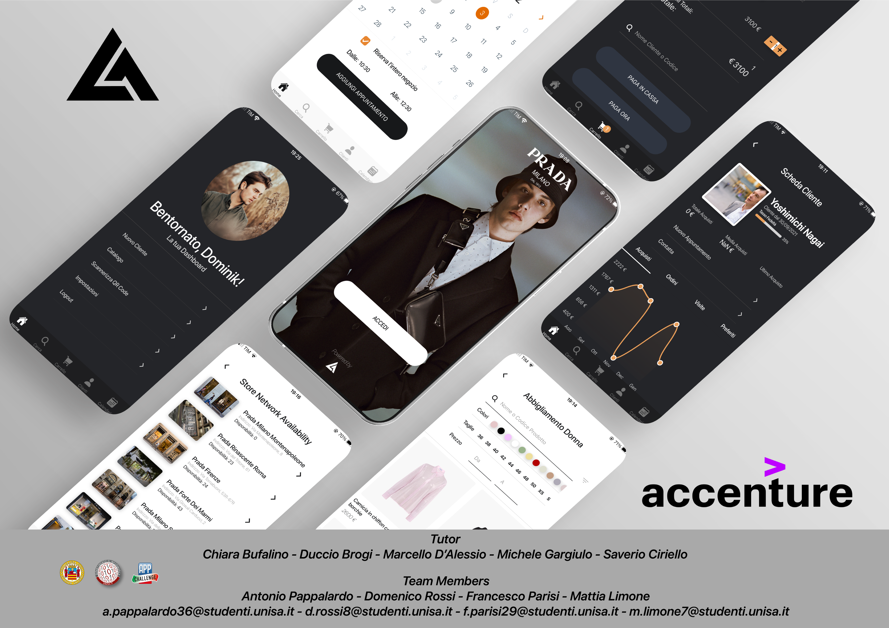

# Luxer Assistant
Progetto realizzato nell'ambito del corso universitario Enterprise Mobile Application Development 2021-2022.



## Guida per l'installazione

Procedere come segue:
- Clonare il repository in locale
- Installare tutte le dipendenze da terminale tramite il seguente comando:
```sh
npm install
```
- Eseguire l'app tramite comando:
 ```sh
npm start
```

## Descrizione
Luxer Assistant è un'applicazione cross-platform pensata per offrire funzionalità a supporto dello shop assistant, al fine di rendere unica l'esperienza di acquisto dei propri clienti e al contempo favorirne la fidelizzazione. Rivolta principalmente ai grandi marchi di moda, Luxer Assistant è stata ideata per agevolare lo shop assistant in svariati attività, come la visualizzazione dello storico degli acquisti, fornendo info utili per poter fare cross-selling. Si potrà quindi suggerire prodotti in base ai gusti del cliente. La frequenza e l’entità degli acquisti stabiliscono un livello di loyalty che sarà indispensabile per riservare parzialmente o interamente lo shop desiderato.

## Obiettivi

L’obiettivo è migliorare l’esperienza del cliente fornendo allo shop assistant un nuovo strumento di lavoro, tramite questo egli avrà difatti accesso a 360° alle info sull’acquirente, rendendo unico il momento dell’acquisto. Le informazioni sui gusti e gli stili fornite al personale di negozio consentiranno di incrementare le vendite mediante una mirata attività di cross-selling. L’interfaccia User-Friendly è un punto di forza della soluzione presentata, la facilità di interazione consente all’assistente di portare a compimento tutte le operazioni senza che sia necessaria alcuna guida d’uso.
L’applicazione presenta vari aspetti, tra cui:
- Offrire la possibilità di visualizzare il catalogo dei prodotti in negozio, caratterizzato da diverse sezioni in base alla tipologia del prodotto;
- Offrire la possibilità allo shop assistant di visualizzare un prodotto, con tutte le informazioni di cui necessita per la sua vendita;
- Offrire la possibilità allo shop assistant di fare in modo che, in caso di mancanza di un prodotto in negozio o in magazzino, di farlo visualizzare in realtà aumentata al proprio cliente;
- Offrire la possibilità di ricercare un certo cliente, tramite nome o codice;
- Offrire la possibilità di ricercare un prodotto, anche tramite la scansione del codice QR;
- Offrire la possibilità di inserire i prodotti scelti nel carrello e poi decidere se pagare direttamente dal dispositivo dello shop assistant (MPOS) oppure in cassa;
- Offrire uno strumento che permetta l’invio di comunicazioni mirate con cliente, anche tramite l’utilizzo di piattaforme di messaggistica popolari;
- Offrire un’interfaccia semplice, intuitiva e accattivante;
- Offrire la possibilità di prenotare appuntamenti per il propri clienti, gestendo in maniera semplice quelli che sono gli orari disponibili per la prenotazione di un reparto o del negozio;

